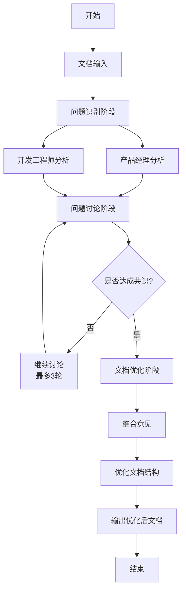

# TODO：更换logo

## 背景

本来春节计划去普吉岛度假，但为了我和朋友们的肾脏着想，我们还是在出发前退了机票--开年直亏2000+。人算不如天算，现在腾出来几天空闲时间不再被无聊的CURD的工作填满，那岂不是终于有时间把我poe2中的召唤打通巅峰试炼，把冰电双捷的武僧小号练到T15，然后在剩余的时间搞搞蓄谋已久的side project？

去年11月，Anthropic办的黑马中获奖的第三名非常有意思，既实用又前沿--产品是一个让多智能体分别扮演不同的角色，如用户体验负责人、数据科学家、财务经理和首席执行官等，对一份产品需求文档草案进行讨论，然后利用得出的结论来自动完善产品需求文档。

 // TODO：插入图片说明

这个天才的想法完全击中了我，但没有击中我的老板--很遗产，我们公司做产品功能从来都不通过产品需求文档来传达信息，富含禅意的AC123和口口相传更适合华夏文明孕育下的敏捷宝宝食用。不管怎么说，我基于这个想法做了个最基础的demo，将其命名为SynergyAI（协智AI），接下来阐述一下它的工作思路。

## 工作思路

我将 SynergyAI 设计为采用"虚拟圆桌会议"的形式来优化产品需求文档。整个过程分为三个主要阶段：

### 1. 问题识别阶段

- 设置两位AI专家角色:资深软件产品经理和资深软件开发工程师（demo仅设两个角色，这里从思路来说当然是可拓展的）
- 每位专家从其专业视角对文档进行审阅
- 产品经理关注产品层面的问题（如用户体验、功能完整性）
- 开发工程师关注技术层面的问题（如实现可行性、安全性）

### 2. 问题讨论阶段
- 采用轮次讨论机制，最多进行3轮讨论
- 每轮讨论中：
  - 产品经理首先针对双方提出的问题进行分析和回应
  - 开发工程师对产品经理的观点进行技术可行性分析
  - 系统分析双方观点，判断是否达成共识
- 当达成共识或完成3轮讨论后，进入文档优化阶段

### 3. 文档优化阶段
- 基于达成的共识
- 保持文档原有结构
- 整合各方意见
- 输出优化后的文档版本

通过这种多角色协作的方式，确保文档的优化既考虑了产品价值，也权衡了技术实现的可行性。整个过程模拟了真实团队的协作模式，但通过AI实现了更高效的沟通和文档迭代。

### 工作流程图



## 快速开始

### 1. 环境准备

- Python 3.8+
- 安装依赖包：
```bash
pip install openai
```

### 2. 环境变量配置
在系统环境变量中配置以下参数（根据您选用的LLM服务商选择其一）：
```bash
# Silicon Flow (默认配置)
SILICONFLOW_TOKEN=your_token_here

# 或者使用 OpenAI
# GITHUB_TOKEN=your_openai_token_here

# 或者使用 Deepseek
# DEEPSEEK_TOKEN=your_deepseek_token_here
```

### 3. LLM服务配置说明
在 llm_client.py 中，以下参数目前是硬编码的，可以根据需要修改：
```bash
# Silicon Flow配置（默认）
self._endpoint = "https://api.siliconflow.cn"
self._default_model = "Qwen/Qwen2.5-32B-Instruct"

# OpenAI配置（需要取消注释）
# self._endpoint = "https://models.inference.ai.azure.com"
# self._default_model = "o1-mini"

# Deepseek配置（需要取消注释）
# self._endpoint = "https://api.deepseek.com"
# self._default_model = "deepseek-chat"
```

### 4. 准备文档
在项目根目录下创建 sample_document.md 文件
将需要优化的产品文档内容按Markdown格式写入该文件

### 5. 运行程序
```bash
python SynergyAI_demo.py
```

注意事项:
- 程序默认使用Silicon Flow的Qwen2.5-32B-Instruct模型
- LLM服务调用失败时会自动重试（最多3次）
- 所有API调用都有完整的错误处理和重试机制
- 可以通过修改 max_retries 和 retry_delay 参数调整重试策略

## 效果展示

### 案例

为了方便直观感受到优化效果，以下案例展示原始文档与优化后文档的区别。从案例中可以观察到以下几个方面：

语言表达： 原始文档可能冗长、模糊或不专业，而优化后的文档更加简洁、准确。
逻辑结构： 优化后文档更符合逻辑层次（如从背景到目标再到细节）。
用户体验： 优化后文档对不同角色（产品经理、开发人员、设计师等）的友好程度有所提升。

#### 输入文档

手上没有正经PRD，用gpt4o生成了一份反面教材，正好也不涉敏。

```markdown
# Web 登录页 PRD

## 1. 概述
本项目将提供一个单一的 Web 登录页面，用于让用户输入账号、密码后直接登录到系统。暂时无需其他功能，也不考虑后续扩展。

## 2. 功能需求
1. 支持邮箱或手机号作为账号。  
2. 密码最少 6 位，无字符类型或长度上限。  
3. 不需要错误次数限制，无需锁定机制。  
4. 登录后直接跳转至主页，无任何过渡提示。

## 3. 流程说明
1. 用户在浏览器中输入登录页地址并访问。  
2. 页面加载完成后，输入账号和密码，点击“登录”。  
3. 系统校验登录信息，同步返回成功或失败结果。  
4. 登录成功则跳转至主页，失败仍停留在本页面。

## 4. 界面规划
- 页面主体仅包含两个输入框（账号、密码）与一个登录按钮即可。  
- 按钮颜色设置为 #ZZZZZZ。  
- 不需要加载 logo 或额外的公司介绍内容。  
- 排版顺序不做要求，可以随意放置。

## 5. 交互方案
- 登录表单提交至 /api/login，与现有后台接口对接。  
- 登录成功后跳转至 /home。  
- 无需考虑前端加密或 SSL 配置。

## 6. 时间安排
- 需求完成时间：与设计稿同步，具体日期暂不确定。  
- 开发开始时间：待定。  
- 测试阶段：待定。  
- 上线：待定。

## 7. 验收标准
- 输入正确的账号和密码，点击“登录”后可以跳转到主页。  
- 输入错误的账号或密码时，页面只需要原地提示“登录失败”。  
- 界面大致与现有系统风格保持一致即可。
```

### demo执行输出

执行过程的日志输出与最终的优化文档输出。

**补充说明**：由于`GitHub Models`中的上下文限制过少，`Deepseek`春节期间线上服务又受到大规模恶意攻击，最终是使用的是`Qwen/Qwen2.5-32B-Instruct`执行的demo，可以看到效果也不错。

```bash
PS D:\Vincent\dev\AI_4_creative\SynergyAI> python .\SynergyAI_demo.py

=== Starting Virtual Roundtable Discussion ===

Phase 1: Initial Problem Identification     

Product_Manager is analyzing the document...
Product_Manager's issues:
基于提供的文档，以下是产品角度的一些关键问题：

1. **安全性考量**:
   - 项目的描述明确说明无需考虑前端加密或SSL配置。鉴于登录页的敏感性质，缺乏SSL和前端加密可能会造成账号和密码在网络传输过程中被截获的风险，这是否符合公司和客户的预期？
   - 为何不设置错误次数限制和账户锁定机制？没有这些保护可能会使系统容易受到自动化攻击。

2. **用户体验**:
   - 登录成功后不显示任何提示信息直接跳转，可能会导致用户在极简操作中不确认是否成功登录。考虑增加一个反馈以确保用户体验。
   - 验证明确的失败提示（只显示“登录失败”）而无具体指点（比如是账号还是密码错误）可能会导致用户的困惑和重复的试错。

3. **可扩展性**:
   - 文档中提到“暂时无需其他功能，也不考虑后续扩展”。这是一种不太灵活的态度，尤其是对于登录页面设计。登录功能最初看起来简单，但随着产品发展，功能扩展（如社交账号登录，密码找回，多因
素认证等）可能会成为需求。请评估这一决定对未来需求的影响并做出策略规划。
   
4. **技术细节**:
   - 直接跳转到主页时未明确指定是采用重定向还是手工编码跳转。需确认后端的具体操作方式，以及如何管理会话（session）和保证用户的使用流畅性。

5. **界面设计**:
   - 按钮颜色指定的#ZZZZZZ是一个占位符，实际颜色应该明确定义，以符合品牌和系统风格。
   - 输入框（账号、密码）布局灵活性的描述显得暧昧。最好有个明确的要求或示例，确保所有UI设计师在设计时保持一致性。
   
6. **时间线及沟通**:
   - 时间安排中的各项日期被标记为“待定”，如果重要项目关键节点没有具体的计划，将直接影响项目的进度和资源配置。明确时间表是一项重要任务，确保上下信息畅通，所有团队成员对进度都有清晰的
认识。
   
这些问题的答案将帮助产品团队进一步优化文档，确保设计的登录页面满足所有用户需求和标准，且安全可靠。

Developer is analyzing the document...
Developer's issues:
审阅这份 PRD 文档，基于技术实现角度，以下是一些关键问题：

1. **安全性问题**：
   - 文档中提出“无需考虑前端加密或 SSL 配置”，这是一个非常严重的问题。在进行网络传输数据时，尤其是处理如账号密码这种敏感信息，必须使用 SSL/TLS 来保护数据的安全，以防止中间人攻击。
   - 由于没有前端加密，账号和密码将以明文形式传输，这在现代网络安全环境中是不被接受的。

2. **错误处理和反馈**：
   - 对于认证失败的情况，只提供“登录失败”提示信息太过笼统，用户可能无法确定是账号、密码错误或者其它什么问题。建议提供更具体的错误提示，以便用户进行自我纠正。

3. **登录机制-同步还是异步**：
   - 尽管说明中说“系统校验登录信息，同步返回成功或失败结果”，但在Web应用中，异步机制更为常见。使用同步机制可能会导致页面直接卡顿。如果确实考虑到同步，需要详细说明背后的理由和设计， 
因为这并不是网络应用开发中的常规做法。

4. **没有密码强度要求和存储规则说明**：
   - 文档并未说明密码的存储方式，未提到使用了哈希加密等安全措施，也未提及哪怕是最基本的密码强度建议（尽管指出了最少6位的要求，但没有其他限制）。这对确保账户安全是必不可少的。       
   - 密码存储时必须使用哈希和盐（salt）组合，而不是明文存储。

5. **没有关于响应处理的说明**：
   - 尽管文档说明了登录成功或失败会返回相应的结果，但没有具体说明如何处理这些结果。例如，如果网速慢或服务器出现问题的情况下如何处理？

6. **账号限制**：
   - 账号是支持手机号还是邮箱，这两种方式同时提供还是只能选择一种？如果允许两者，那么在账号和密码的验证逻辑中需要如何处理？

7. **没有设备兼容性与响应式布局的说明**：
   - 项目中并未指明是否需要支持不同设备的响应式设计，尤其是在界面规划中没有提到这些细节，这可能会是用户体验的一个重要环节。

这些问题如果得不到妥善处理，将直接影响到项目的安全性、用户友好性和实用性。因此，建议在 PRD 文档中进一步详细说明这些内容，并建议对公司安全和用户隐私需求进行认真考量。

Phase 2: Discussion Rounds

--- Round 1 ---

Product Manager's turn:
针对开发工程师和产品经理提出的问题，以下是对这些问题的分析以及建议的回应：

### 安全性
- **SSL 和前端加密问题**：
  - 当前文档确实没有增述使用 SSL 或者前端加密以保护用户登录数据的传输，这是一个重大隐患，尤其是涉及账号和密码的传输过程中，缺乏这些措施会使数据容易受到攻击。**建议**在文档中明确要求
使用 SSL 来进行 HTTPS 连接，以确保数据传输的安全性，并考虑增加前端加密机制。

- **错误次数限制和账户锁定机制**：
  - 虽然文档中说明了不采用这些机制，但这增加了系统被自动化攻击的风险。**建议**至少加入基本的错误次数限制以及临时锁定机制，可以设定在连续5次错误登录后，自动锁定该账户一定时间后再对其
解锁。

### 用户体验
- **登录反馈信息**：
  - 登录完成后直接跳转到主页而没有反馈信息的做法可能会给用户带来不确定性。**建议**在页面上增加简单反馈信息，如“登录成功”弹窗，确保用户明确知道其登录状态。

- **明确的失败提示**：
  - 当前只显示“登录失败”的提示太过宽泛，难以帮助用户识别具体的问题。**建议**可以根据错误的情形提供更具体、更友好的错误提示，例如“账号不存在”或“密码错误”。

### 扩展性
- **产品的可扩展性策略**：
  - 文档中提到短暂内不要扩展其他功能，但这种僵硬的设计可能会限制未来的灵活扩展。**建议**在进行原型设计时就考虑未来扩展的可能性，比如通过增加插槽（slot）预留扩展区域的方式来提高设计 
的灵活性。

### 技术实现
- **登录验证机制**：
  - 关于同步或异步登录验证机制，虽同步机制非一般Web应用所采用，但需要根据产品特性和用户体验需求决策。**建议**重新评估异步机制对用户登录体验的影响，必要时采用异步机制以提高用户体验。

- **密码存储安全措施**：
  - 登录页面需要确保密码的存储安全，包括利用哈希和盐来存储密码。**建议**在文档中明确提及密码的哈希存储规则和其他安全措施。

### 界面设计与设备兼容性
  - **具体颜色和其他UI设计细节**：
    - 应将所有颜色定义具体以符合品牌一致性，**建议**明确记明具体的RGB或Hex值，以便UI设计师能在设计过程中遵循一致的色彩风格。

  - **响应式设计**：
    - 项目文档中未提及设备兼容性策略。**建议**增加一个部分专门讨论界面需要适应的设备类型以及响应式布局的具体技术需求，保证不同设备上用户体验的一致性。

### 时间线及沟通
- **具体的项目时间表**：
  - 文档的时间安排过于模糊。**建议**在文档中加入实际的项目时间表，包括需求收集完成日期、设计稿完成时间、公布开发、测试和上线时间。这样可以帮助团队成员进行时间和资源准确分配，确保项 
目进度的透明性。

本次文档的制定应突出用户需求的满足以及确保登录页面的安全性及其到其他功能区域的良好过渡。针对以上问题的回应将有助于进一步优化页面设计，确保其在未来能够适应产品迭代的需求。

Developer's turn:
针对产品经理提出的各项建议和意见，作为开发工程师，我们有以下回应和考虑：

### 安全性
- **SSL 和前端加密**：我们将采纳这个建议，使用 HTTPS 来确保数据传输的安全性，同时也考虑添加前端加密机制，尤其是在敏感信息（如密码）传输时增加一层保护。开发团队将依据产品实际需求评估
最合适的安全措施。
- **错误次数限制和账户锁定机制**：确实增加这类机制可以显著提高安全性，特别是防止暴力破解攻击。我们会在系统设计中考虑到这一点，并可能实现这种较为安全的机制，具体细节可以通过与安全领 
域的专业团队沟通进一步细化。

### 用户体验
- **登录反馈信息**：合理的用户反馈确实能够显著提升用户体验，顺应这个建议，在系统成功登录后通过弹窗或页面上的提示语来确认操作。这将帮助用户清楚了解他们的操作状态。
- **明确的失败提示**：这也是一个很好的用户体验增强点，提供具体的错误提示可以帮助用户更快地解决问题，提高整体的易用性。我们将设计通用的提示模板，并针对账号错误、密码错误等不同情况作 
出详细定义。

### 扩展性
- **产品可扩展性策略**：针对未来扩展性做出前瞻性设计是前端开发中的一个重要环节，采纳此建议，我们将在基础架构中预留扩展区域，确保即使在初期功能较少的情况下，也能为未来的功能拓展打下 
基础。

### 技术实现
- **登录验证机制**：关于同步或异步验证机制的选择，异步机制更能适应现代Web应用的用户期望，能够减少用户的等待时间，提升体验。我们将进行技术评估决策哪种方式更适合我们的项目。
- **密码存储安全措施**：密码的存储安全是至关重要的，将确保所有密码采用哈希加盐的方式存储，这不仅是遵守行业安全标准，也是增强用户信任的一个重要步骤。

### 界面设计与设备兼容性
- **具体颜色和其他UI设计细节**：明确的色彩代码将帮助保证致性，我们同意在文档中明确记明所有重要的颜色规范等细节。
- **响应式设计**：这是移动优先时代必须考虑的设计原则，增加覆盖率以及讨论界面适应性将显著提升不同设备用户的体验。我们将设计内容针对不同的设备类型进行验证和优化。

### 时间线及沟通
- **具体的项目时间表**：这确实能够提升项目管理的透明度和效率，我们将会与项目管理团队协作，共同制定更加详细的项目时间表来更好地协调团队的开发工作。

项目经理提出的这些问题是重要的，并且对于提高Web登录页的总体质量至关重要。我们准备在这些建议的基础上继续优化，同时将在开发过程中与产品管理和设计团队保持密切沟通，以确保项目的顺利进行
。

Checking for consensus...
Consensus status:
基于当前讨论进展，从产品经理和开发工程师的反馈来看，双方已经就多种改善和安全协议达成共识，但也涉及一些需要进一步商讨和确认的事项。以下是达成共识和需要进一步讨论的要点：

### 达成共识的要点：
1. **安全性**：
   - SSL/HTTPS的实施；
   - 对密码进行哈希加盐存储；
   - 考虑使用或允许前端加密（根据项目实际需求）；
   - 增加错误次数限制和账户临时锁定机制，作为提高安全性的措施之一。

2. **用户体验**：
   - 增加登录成功后和登录失败时的明确反馈，以增强用户操作清晰度和体验。
   - 提供具体而非宽泛的登录失败提示（例如区分错误的账号和密码错误）。

3. **产品扩展性**：
   - 在设计中预留未来扩展区域，使得前端架构具有灵活性。

4. **技术实现**：
   - 评价是否采用异步登录验证机制，目标是提升用户体验。

5. **界面设计与设备兼容性**：
   - 明确关键的色彩代码，以保持界面一致性。
   - 实现响应式设计，确保跨设备的使用体验。

### 需要进一步讨论和确认的事项：
- **关于登录验证机制（同步 vs 异步）的最终决策**：需要进行具体的用户体验和性能评估；
- **具体实现错误次数限制和账户锁定机制的细节**：例如，多少次错误后锁定以及锁定的时间长度。

鉴于以上结果，可以总结为“部分共识达成”，但为了完全覆盖所有可能的改进方向并确保项目的成功，还需就一些技术决策和具体实现细节进行进一步讨论和确认。

Consensus reached!

Phase 3: Final Document Optimization

=== Virtual Roundtable Discussion Completed ===

Optimized document:
# Web 登录页 PRD (优化版)

## 1. 概述
本项目将提供一个单一的 Web 登录页面，用于用户输入账号与密码登录系统。该页面为用户登录入口，设计以安全性和用户体验为核心，并为未来可能的功能扩展预留接口。

## 2. 功能需求
1. 支持邮箱或手机号作为账号。
2. 密码最少需6位，无字符类型或长度上限；所有用户密码在存储前进行哈希加盐处理。
3. 实施SSL/TLS以保障数据传输安全。
4. 增加登录失败次数限制，并设定次数超过限定值后的临时账户锁定机制。
5. 登录成功后直接跳转至主页，传达反馈给用户以提高操作清晰度。

## 3. 流程说明
1. 用户在浏览器中输入登录页地址后访问该页面。
2. 页面加载完成后，输入账号及密码，点击“登录”提交信息。
3. 系统同步或异步校验登录信息，根据校验结果确定是否跳转至主页，并返回明确的反馈信息给用户。
4. 若登录成功，则系统自动跳转至主页；若登录失败，停留在登录页，相应展示具体原因（如：“邮箱未注册”或“密码错误”）。

## 4. 界面与设计
- 页面简单化设计，使用响应式布局，确保跨设备良好的用户体验。
- 页面仅设置两个输入框（账号、密码）与一个登录按钮。
- 按钮颜色统一设置为#RRGGBB。
- 页面不包含logo和公司介绍信息。

## 5. 交互方案
- 表单数据提交至服务器端的/api/login进行验证。
- 确认登录成功后重定向至主页(/home)，若失败返回用户端提供具体失败原因。
- 前端无需实施数据加密，但建议后台提供相关的安全措施。

## 6. 安全性
- 实现HTTPs确保数据传输的安全性。
- 登录失败次数限制机制需具体实施，尤其是达到限制后锁定机制和锁定时长需商议决定。
- 在执行可能危害用户账号安全的操作时，系统需提供适当的验证步骤。

## 7. 时间计划
- 需求完成时间：暂定与设计稿同步，具体时间待定。
- 开发启动时间：待定，需确保需求的详细明确。
- 审查和测试时间：待定，需基于开发进度来确定。
- 预计上线时间：根据项目进度而定。

## 8. 验收标准
- 用户能够通过正确的账号和密码信息登录，并成功跳转到主页。
- 向用户提供明确的登录失败反馈给用户，例如具体指出是账号未找到或密码错误。
- 界面简洁，保持与现有系统风格的统一，且能够适应不同设备的访问需求。

请在文档基础上，继续就登录验证机制（同步 vs 异步）进行评估，确定最终实现方案。同时，对于错误次数限制的具体实现细节，需进一步制定明确规范如锁定时长及复位条件。
PS D:\Vincent\dev\AI_4_creative\SynergyAI> 
```

## 未来展望

虽然这只是一个极简的demo，但已经可以初步展现出工具能力。而且这只是其中一个具体的使用场景，经过适合的拓展，实际上它拥有模拟各种需要多个复合工种、立场的实体针对同一件事模拟讨论的能力，这种讨论无论是过程产出还是最终的结论，都会加深我们对事情的理解，减轻认知负担。想象一下：你需要模拟面试时，输入简历后，设置多轮技术角色、主管角色、hr角色一起讨论你的简历，会对你面试的帮助有多大；或者当你需要起草一份专利申请，既需要找技术背景的同事讨论，又需要找法律背景的同事帮你review，有AI帮你完成这类工作时效率会有多少提升？
